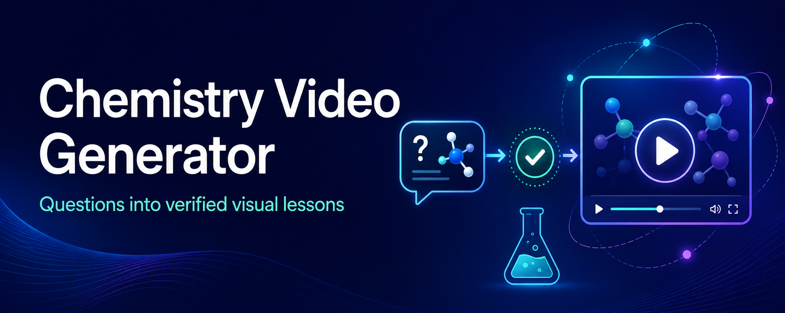

https://github.com/user-attachments/assets/4ded910c-ffa2-45e6-8701-6440ec3c1759

<p align="center">
  
</p>

<h1 align="center">Chemistry Video Generator</h1>

<p align="center">
  <strong>Generate a verified, high-school-level chemistry explainer video from a single question.</strong>
</p>

<p align="center">
  
  
  
  
  
</p>

<p align="center">
  <a href="#sample-video">Sample video</a> ·
  <a href="#v1-scope">Scope</a> ·
  <a href="#architecture">Architecture</a> ·
  <a href="#backend-architecture">API</a>
</p>

## Sample video


https://github.com/user-attachments/assets/83a7f5cd-9aa9-4a98-9153-5d7be05379c5

**Question:** “What is the difference between an atom and a molecule?”

```json
{
  "question": "What is the difference between an atom and a molecule?",
  "learner_level": "high_school",
  "duration_seconds": 240
}
```

<video src="media/sample-video.mp4" width="600" controls></video>


The tracked sample above is copied from a validated local pipeline run. New
videos are generated under `artifacts/`, which remains excluded from version
control.

## V1 Scope

- **Domain:** General chemistry
- **Learner:** High school students
- **Input:** One chemistry question
- **Duration:** 3–5 minutes
- **Reasoning:** LLM supported by chemistry and math tools
- **Output:** 1080p narrated educational animation

### Supported question types

- Atomic structure and periodic trends
- Chemical formulas, naming, and bonding
- Balancing chemical equations
- Mole and stoichiometry calculations
- Gases and solutions
- Acids, bases, and introductory equilibrium
- Thermochemistry and introductory reaction rates

### Not supported in V1

- Advanced organic mechanisms or synthesis planning
- Quantum chemistry and university-level physical chemistry
- Open-ended laboratory design or hazardous procedural guidance
- Questions requiring experimental findings or uncertain research claims

## Architecture

### GPT Chemistry Providers

When `OPENAI_API_KEY` is configured, the service uses the OpenAI Responses API for chemistry reasoning and independent semantic review. Without the key, deterministic fake providers remain active for local tests.

```bash
export OPENAI_API_KEY="your-api-key"
export OPENAI_MODEL="gpt-5.5"
PYTHONPATH=src python -m uvicorn chemistry_video.api:app --reload
```

The reasoner sends a teenager-safe system prompt, the stable chemistry developer prompt, and the serialized user request. Responses use strict JSON Schema output based on `ReasoningOutput`, medium reasoning effort, and low verbosity. Molecules use `{ "name": "water", "smiles": "O" }`; prose descriptions must not be placed in `smiles`. Verification remains deterministic and uses Pydantic, SymPy, Pint, ChemPy, and RDKit; it does not call GPT.

```text
Chemistry question
        ↓
Chemistry Reasoner ──→ RDKit / SymPy / unit tools / references
        ↓
Verifier ⇄ correction loop (maximum 3 attempts)
        ↓
Pedagogy Agent
        ↓
Scene Planner ──→ shared event timeline
        ↓                         ↓
Visual Renderer              TTS Narration
(Manim + LaTeX + RDKit)            ↓
        └──────────────→ Synchronizer
                               ↓
                    1080p narrated video
```

### Backend Architecture

#### FastAPI layer

```text
POST /videos
GET  /videos
GET  /videos/{video_id}
GET  /videos/{video_id}/status
GET  /videos/{video_id}/artifact
```

Status updates should normally be performed internally by the orchestrator rather than exposed as an unrestricted public endpoint.

Optional internal endpoint:

```text
PATCH /internal/videos/{video_id}/status
```

#### Job model

Keep the overall job status simple and put detailed progress in `current_stage`.

```json
{
  "id": "vid_123",
  "question": "How does the pH scale work?",
  "status": "queued",
  "current_stage": null,
  "attempt_count": 0,
  "error": null,
  "job_created_at": "2026-09-05T10:00:00Z",
  "video_posted_at": null,
  "artifact_id": null
}
```

Recommended overall statuses:

```text
queued
processing
completed
failed
```

Recommended stages while `status = processing`:

```text
chemistry_reasoning
chemistry_verification
pedagogy_adaptation
script_scene_planning
audio_generation
visual_generation
scene_composition
quality_checking
uploading
```

Example during processing:

```json
{
  "status": "processing",
  "current_stage": "visual_generation"
}
```

This is cleaner than placing all detailed stages inside the main `status` field.

#### Job orchestration

The orchestrator:

- Moves the job through its lifecycle.
- Runs the video-generation pipeline.
- Executes independent verification checks in parallel.
- Produces scenes concurrently where resources permit.
- Records stage attempts and errors.
- Retries only the failed stage or scene.
- Resumes from the last valid checkpoint.
- Updates job status and progress.
- Publishes the artifact after final validation.

```text
FastAPI request
      ↓
Create queued job
      ↓
Orchestrator
      ↓
Video-generation pipeline
      ↓
Quality gate
      ↓
Publish artifact
```

#### Persistence

Use two separate storage boundaries:

```text
Job repository
→ job metadata, statuses, attempts and errors

Artifact store
→ JSON outputs, audio, scenes, captions and final video
```

For the prototype:

```text
SQLite + local filesystem
```

#### Artifact structure

```text
artifacts/
└── vid_123/
    ├── reasoning.json
    ├── verification.json
    ├── pedagogy.json
    ├── scene_plan.json
    ├── audio/
    ├── scenes/
    ├── captions.srt
    ├── quality_report.json
    └── final.mp4
```

Intermediate artifacts act as checkpoints and debugging evidence. `final.mp4` should only become publicly retrievable after quality checks pass.

#### Overall backend architecture

```text
Client
  ↓
FastAPI
  ↓
Job repository
  ↓
Job orchestrator
  ↓
Video-generation pipeline
  ↓
Artifact store
  ↓
Final validated video
```

### Model Architecture

| Stage | Selected approach |
|---|---|
| Chemistry reasoning | GPT with medium reasoning and strict JSON output. |
| Safety and audience | System-level teenage and chemistry-safety policy. |
| Chemistry behavior | Stable developer prompt. |
| Verification | Pydantic, ChemPy, SymPy, Pint, RDKit, and independent GPT review. |
| Pedagogy | Bounded LLM transformation. |
| Script planning | LLM-generated narration and structured visual plan. |
| Narration | GPT TTS, generated by segment. |
| Timing | Actual TTS durations drive visual timing. |
| Visual generation | Adapted Code2Video Coder/Critic and Manim renderer. |
| Composition | Audio-video muxing, concatenation, normalization, and encoding. |
| Final validation | Technical, audio, visual, and content checks. |
| Output | Stored 1080p narrated MP4 lasting 3–5 minutes. |

## Component Responsibilities

### Manual FFmpeg Composition Test

To compose an existing job without rerunning the API or LLM stages, use the
Python 3.11 environment and pass an existing artifact ID:

```bash
source .venv311/bin/activate
PYTHONPATH=src python scripts/manual_compose.py vid_abc123
```

The command reads `scene_plan.json`, copies each scene's draft MP4 and ordered
narration MP3 files into `scene_composition/`, muxes audio and video with FFmpeg,
and creates `artifacts/<video_id>/final.mp4` by concatenating the composed scenes.
It prints a JSON list of the generated artifact paths. The command requires
`ffmpeg` and `ffprobe` on `PATH`.

| Component | Responsibility |
|---|---|
| Chemistry Reasoner | Solve the question, identify concepts and assumptions, and produce structured chemistry content. |
| Chemistry tools | Validate molecules with RDKit, algebra with SymPy, numerical work with calculators, and dimensional consistency with a unit checker. |
| Verifier | Check factual, mathematical, chemical, and reference-backed claims; return precise correction instructions. |
| Pedagogy Agent | Adapt verified content for high-school learners without changing its scientific meaning. |
| Scene Planner | Convert the lesson into timed scenes, narration segments, visual cues, and transitions. |
| Visual Renderer | Produce Manim animation, LaTeX equations, plots, and RDKit molecular diagrams. |
| TTS Engine | Generate narration audio from the approved script. |
| Synchronizer | Align narration, animations, captions, and pauses on one event timeline. |
| Video Composer | Render and encode the final 1080p video. |

## Suggested Schemas

Each stage should exchange validated structured data rather than free-form text.

### Verified lesson content

```json
{
  "question": "",
  "learning_objectives": [],
  "prerequisites": [],
  "concepts": [],
  "equations": [],
  "reactions": [],
  "molecules": [],
  "reasoning_steps": [],
  "assumptions": [],
  "common_misconceptions": [],
  "key_takeaways": [],
  "references": []
}
```

Equation, reaction, and molecule entries should include stable IDs so verification findings and scenes can refer to them directly.

### Verification report

```json
{
  "status": "pass",
  "checks": [
    {
      "target_id": "equation_1",
      "check": "unit_consistency",
      "status": "pass",
      "message": ""
    }
  ],
  "required_corrections": [],
  "attempt": 1
}
```

### Shared event timeline

```json
{
  "duration_seconds": 240,
  "events": [
    {
      "id": "event_1",
      "start": 0.0,
      "end": 8.5,
      "scene_id": "scene_1",
      "narration": "",
      "visual_action": "",
      "caption": "",
      "asset_ids": []
    }
  ]
}
```

## Workflow

1. Classify the question and reject or flag requests outside the V1 scope.
2. Produce a structured solution with explicit assumptions and references.
3. Run deterministic checks, followed by reference and LLM-based checks.
4. If verification fails, send structured findings to the reasoner and retry up to three times.
5. Turn verified content into a short lesson using the pedagogy rules below.
6. Plan scenes and create a shared timeline for visuals, narration, captions, and pauses.
7. Render visuals, synthesize speech, synchronize all assets, and export at 1080p.
8. Run final content and media quality checks.

## Verification Strategy

Use deterministic tools wherever possible and LLM judgment only where necessary.

| Check | Primary method |
|---|---|
| Reaction balancing and conservation | Deterministic chemistry logic |
| Molecule and valence validity | RDKit |
| Algebra and equation manipulation | SymPy |
| Numerical calculations | Calculator or SymPy |
| Units and dimensions | Unit checker |
| Scientific explanations and claims | Trusted references plus LLM review |
| Pedagogical clarity | Rubric-based LLM review |

On failure, the verifier identifies the affected field, explains the issue, and requests a specific correction. The reasoner revises only the affected content before verification runs again. After three failed attempts, stop and return an actionable error instead of silently producing a video.

## Pedagogy Principles

1. Begin with intuition, then introduce notation and equations.
2. Explain every symbol before using it.
3. Introduce no more than one or two new ideas per scene.
4. Use concrete examples and visual analogies when they are scientifically accurate.
5. Show reasoning in short, meaningful steps without unnecessary derivations.
6. Address the most likely misconception explicitly.
7. End with a concise recap tied to the original question.

## Evaluation Criteria

- **Scientific correctness:** Claims, equations, reactions, molecules, and units pass verification.
- **Answer completeness:** The video answers the submitted question and states necessary assumptions.
- **Learner fit:** Language, pacing, prerequisites, and examples suit high-school students.
- **Clarity:** Symbols are introduced, reasoning is easy to follow, and scenes are not overloaded.
- **Timing:** Runtime stays within 3–5 minutes and narration fits its visual events.
- **Media quality:** Equations are legible, visuals are accurate, audio is clear, and captions are synchronized.
- **Traceability:** Important claims and generated assets can be traced to structured content and references.

## Roadmap

1. **Text prototype:** Build the structured reasoner, schemas, scope classifier, and verification loop.
2. **Lesson prototype:** Add pedagogy transformation, scene planning, and timeline validation.
3. **Media pipeline:** Integrate Manim, LaTeX, RDKit rendering, TTS, captions, and 1080p composition.
4. **Evaluation:** Create a representative question set and automate scientific, pedagogical, timing, and media checks.
5. **V1 release:** Add observability, caching, failure reporting, and safe production limits.

## V1 Success Condition

Given a supported chemistry question, the system consistently produces a scientifically verified, understandable, synchronized 3–5 minute video for a high-school learner—or returns a clear, structured explanation of why it could not.
